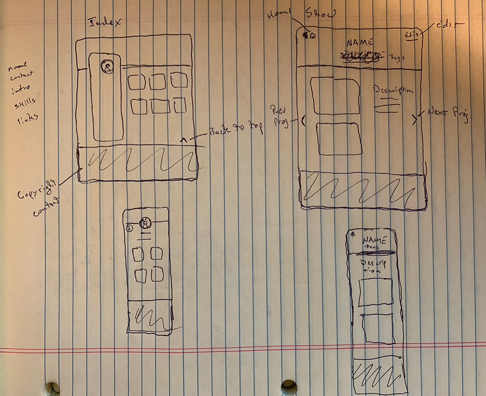

# Portfolio Website

## Concept
The goal of this project was to create a portfolio site to display my work. THe site includes the ability to create, read, update and delete portfolio items and the ability for a user to contact me. 

## Technologies Used
- HTML
- CSS
- Bootstrap 4
- JavaScript
- React
- Express
- MongoDB
- Mongoose
- Heroku
- Font Awesome

## Approach
I began by initializing all of the file structure then created my express app and installed all of the dependencies. The next step was to  develop the schema for my database. I kept the schema simple with just an image, title and description to make sure I coul dget things running. Next I created my default view and included Bootstrap to have basic styling on all of my routes. I built out my routes starting with the new route and working my way down to the delete route. I then sketched out some basic wireframes to get an idea of where I wanted things on the page and finished them out with Adobe XD. Once I had the wireframes I began to use Bootstrap to style my basic content and add in more infor to my schema including tags and ratings. 

## Challanges
One of the challenges I ran into durng this project was adding some of the dynamic styling in the JSX files. I wanted to use the main image of a portfolio item as the background image for the item on the index page. I accomplished this with some inline styling that uses the image variable from my database. Another challange was using my default view to render items in the header dynamically. I ended up passing the route to the default page and then setting a variable based on the route in order to render items like the home button on all the pages except the index.

## Additional Info

### Initial Wireframes

### Final Wireframes

## App Demo
<https://gumtow-portfolio.herokuapp.com/jgumtow>
